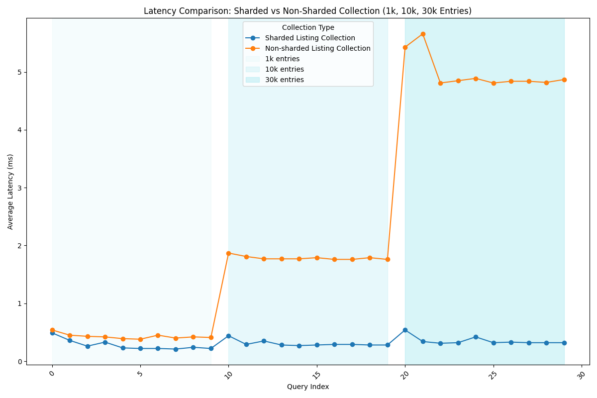
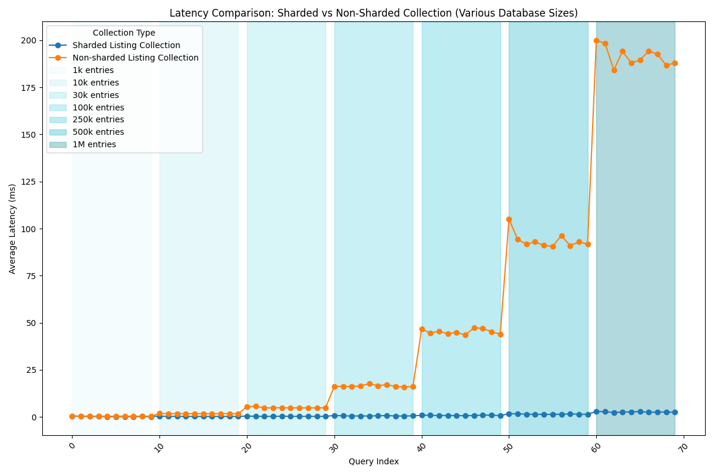
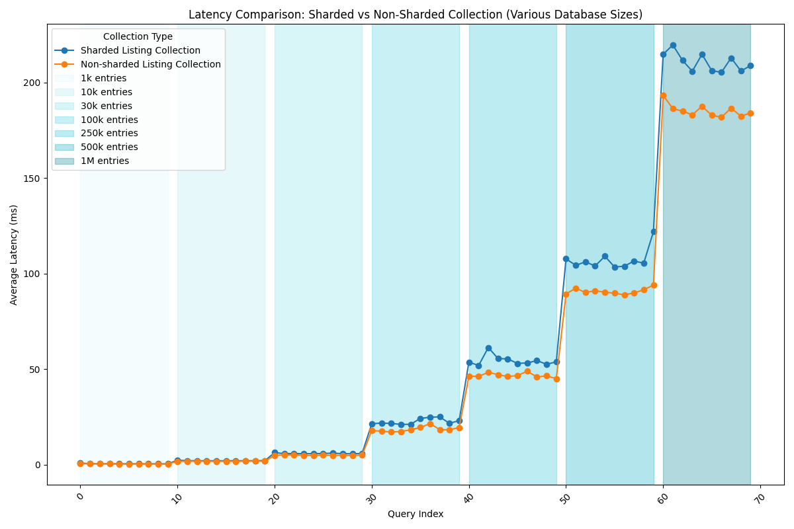
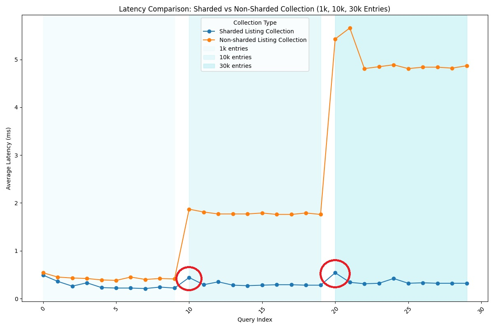

<!-- TOC start (generated with https://github.com/derlin/bitdowntoc) -->

**Word Count of this Document:** 5,869 Words

## Table of Contents

- [Table of Contents](#table-of-contents)
- [1. Introduction](#1-introduction)
- [2. Solution Strategy](#2-solution-strategy)
  - [Tackling Key Quality Attributes](#tackling-key-quality-attributes)
    - [Scalability](#scalability)
    - [Modularity](#modularity)
    - [Confidentiality](#confidentiality)
    - [Functional Correctness](#functional-correctness)
  - [Sound Software Development Practices](#sound-software-development-practices)
- [3. Building Block View](#3-building-block-view)
  - [System Context View](#system-context-view)
  - [Container View](#container-view)
  - [Component View](#component-view)
    - [Component View: Web Application](#component-view-web-application)
    - [Component View: Listings Application](#component-view-listings-application)
    - [Component View: Forms Application](#component-view-forms-application)
    - [Component View: API Gateway](#component-view-api-gateway)
  - [Code View: InformationRenderer](#code-view-informationrenderer)
- [4. Crosscutting Concepts](#4-crosscutting-concepts)
- [5. Runtime View](#5-runtime-view)
- [6. Deployment View](#6-deployment-view)
- [7. Architectural Designs and Alternatives](#7-architectural-designs-and-alternatives)
  - [7.1 Evaluation of Architectural Alternatives](#71-evaluation-of-architectural-alternatives)
    - [Monolithic Architecture](#monolithic-architecture)
    - [Model-View-Controller Architecture (MVC)](#model-view-controller-architecture-mvc)
    - [Event-Driven Architecture (EDA)](#event-driven-architecture-eda)
    - [Layered Architecture (N-tier)](#layered-architecture-n-tier)
  - [7.2 Trade-off Analysis of Different Architectural Designs](#72-trade-off-analysis-of-different-architectural-designs)
- [8. Analysis of Database Sharding Strategy](#8-analysis-of-database-sharding-strategy)
- [9. Proof of Concept](#9-proof-of-concept)
  - [9.1 Architectural Choice](#91-architectural-choice)
  - [9.2 PoC Experiment](#92-poc-experiment)
    - [Motivation for the Choice of Experiment](#motivation-for-the-choice-of-experiment)
    - [Database Sharding Overview](#database-sharding-overview)
  - [Implementation and Setup Process](#implementation-and-setup-process)
  - [Database Population and Chunk Balancing](#database-population-and-chunk-balancing)
  - [Evaluating Database Sharding Performance with High-Frequency Simulation and Discussion](#evaluating-database-sharding-performance-with-high-frequency-simulation-and-discussion)
- [References](#references)
- [Appendix A: Technology Choices for PoC](#appendix-a-technology-choices-for-poc)
    - [Programming Language](#programming-language)
    - [Database and Data Management](#database-and-data-management)
- [Appendix B: WasteWise Architecture](#appendix-b-wastewise-architecture)
  - [API Design](#api-design)
- [Appendix C: Risks and Technical Debts](#appendix-c-risks-and-technical-debts)
- [Appendix D: Glossary](#appendix-d-glossary)
- [Appendix E: Acknowledgments](#appendix-e-acknowledgments)
  - [Wildfires Project](#wildfires-project)
  - [OpenAI](#openai)

<!-- TOC -->

## 1. Introduction

Waste management practices in the Netherlands as well as in the European Union are disintegrated, with limited information accessibility due to private companies managing their own regions, creating a need for a unified system. Although there are systems in place that offer information on waste disposal in different European Union (EU) countries, such systems are managed by private waste management companies rather than a governmental body. Hence, these systems do not provide information about regions where the company does not operate. Therefore, a unified system covering all aspects of waste management is imperative. We designed **WasteWise**, a unified waste management system, to tackle this problem.

The **objective** of this report is to explain the design evolution of our system by describing its architecture, the architectural design decisions that have been made, and introducing the proof of concept (PoC), which illustrates how the decisions made for the system have been implemented. Throughout the report, we make use of a modified arc42 template [1] combined with C4 diagramming techniques [2]. By using these standardized methods, we hope to effectively communicate and document our ideas.

Before we delve deeply into the discussion of the architectural decisions made to realize the WasteWise system, we would like to highlight key points from our problem analysis stage [3]. Conducting comprehensive stakeholder and functional requirement analyses helped us devise user scenarios for our system's most important functionality. Although the problem analysis report provides narrative descriptions of specific interactions between a user and the system through user scenarios, below we only provide a high-level visual representation of the system interactions from the user's perspective by presenting a use case diagram.

  
**Figure 1:** Use Case Diagram

The use case diagram highlights three types of users in our system, with their roles defined as follows:

- **Visitors:** Stakeholders not involved in the collection, processing, or governance of recycling. Examples include civilians and market chain owners.
- **Governmental Users (Admins):** Individuals involved in governmental work, such as municipalities or the EU Parliament, who are responsible for managing the platform and verifying waste collection and processing facilities.
- **Private Owner:** Companies involved in waste collection or processing.

The use case diagram visualizes the key interactions each user type has with WasteWise. It showcases how _Visitors_ can submit requests and view waste-related information, while _Governmental Users_ manage verification tasks and user permissions, and _Private Owners_ manage and interact with listings.

After outlining our system's functionality with a use case diagram, an initial concept of our system was devised. Domain modeling enabled us to simplify the system's functionality from the user's perspective and ensured that all needs and behaviors were captured.

  
**Figure 2:** Domain Model

Our domain covers two types of users, _Company_ and _Admin_, which extend from the _User_ entity. These users must sign up for WasteWise to have access to the _Listing_ platform. The _Company_ must submit a _Verification Form_ to be provided with the credentials to sign up for the system. In addition to the _User_ entities, we have another entity called the _Visitor_, which can visit the system without signing up. _Visitor_ can view the _Map_, which contains _Bin Location_ entities, as well as check the _Calendar_ for _Pickup_ schedules. The _Visitor_ entity can also submit a _Complaint/Suggestion Form_ and a _Bulk Waste Form_. The _Admin_ is responsible for responding to these forms, as well as the _Verification Form_ submitted by the _Company_ entity, to give them access to the system. The microservice boundaries are derived from the discussed domain, aligning with our Domain-Driven Design principle.

As this report focuses on architecture, we provide a summary below of the stakeholders' expectations regarding the architectural design.

| **Stakeholder Role**   | **Expectations Regarding Architecture and Documentation**                                                                                   |
| ---------------------- | ------------------------------------------------------------------------------------------------------------------------------------------- |
| **Administrator**      | - Possible measuring points for performance of the system   - Ability to scale the system up   - Detailed documentation on the system |
| **Governmental Users** | - High performance   - High level of security   - Documentation regarding security and data privacy                                   |
| **Private Owners**     | - High performance   - Secure system   - Information on stored data   - Easy-to-use interface                                      |
| **Visitors**           | - High performance   - Easy-to-use interface   - Information on stored data                                                           |

**Table 1:** Stakeholder Role-Expectations based on arc42

<!-- TOC -->

## 2. Solution Strategy

WasteWise aims to be a pilot project demonstrating innovative and efficient approaches to waste management solutions. To this end, it should have a well-devised and thoroughly thought-out solution strategy that enables others to draw inspiration from it. We have based our solution around achieving the four main _Quality Attributes_ we identified in the problem description report, and corresponding stakeholder expectations introduced before. The table below presents how we aim to tackle each of our quality attributes ordered from the highest priority to the lowest.

| Quality Attribute (Quality Goal) | Why this? (Scenario)                                                                                                                                                                                       | How to Tackle (Solution Approach)           | Main Stakeholders                                               |
| -------------------------------- | ---------------------------------------------------------------------------------------------------------------------------------------------------------------------------------------------------------- | ------------------------------------------- | --------------------------------------------------------------- |
| Scalability                      | It is likely the system will be tried on smaller scales, before proceeding to the Netherlands, and finally to the EU. It should easily scale up to larger domains without breaking existing functionality. | Microservices Architecture                  | Administrators, Governmental Users and Private Owners, Visitors |
| Modularity                       | WasteWise consists of two components (Visitors Page and Listings Page) that are interconnected, but are functioning independently, making it necessary to keep coupling at a minimum.                      | Highly-Cohesive and Loosely-Coupled Modules | Administrators                                                  |
| Confidentiality                  | Different parties on WasteWise should not be able to access information of each other unless strictly necessary.                                                                                           | Multi-Tier Authorization Structure          | Governmental Users and Private Owners                           |
| Functional Correctness           | The system includes time/location-critical information for all stakeholders, making it essential that the data presented is valid and up-to-date.                                                          | Isolated Validation                         | Visitors and Private Owners                                     |

**Table 2:** Quality Goals based on arc42

<!-- TOC -->

### Tackling Key Quality Attributes

The _Quality Attributes_ we have identified in the table above represent the key goals of our system: a scalable and modular system that maintains confidentiality and functional correctness. In order to explain their contributions to our solution strategy, the following section explains how _WasteWise_ tackles each _Quality Attribute_.

<!-- TOC -->

#### Scalability

A **Microservices Architecture** enables _WasteWise_ to initially operate on a small, toy scale when experimenting. After initial experimentation, it can seamlessly transition into a country-wide system. As each microservice can function independently, scaling up the system can be done in parts without breaking functionality during transitional periods. This aspect of the architecture will especially be useful when scaling up to EU level operations, where different legislations of member states may require the separation of previously unified microservices into smaller, more specialized units.

**Database Sharding** is a technique for splitting a large database into smaller partitions called shards [4]. For WasteWise, the strategy is to implement Geographical Sharding, which partitions and distributes data across regions and countries, a crucial approach since our stakeholders are spread across the Netherlands. As the system grows regionally and internationally, sharding improves the performance of read and write operations and offers scalability. These benefits, along with some trade-offs, will be further discussed in [Analysis of Database Sharding Strategy](#8-analysis-of-database-sharding-strategy) section.

<!-- TOC -->

#### Modularity

Bearing in mind that _WasteWise_ offers two main functionalities as independent components, which are the publicly accessible and restricted-access modules, it is essential that its modules are **highly cohesive and loosely coupled**. This supports development by increasing modularity, requiring few changes to the rest of the system for modifications to specific modules. The improved modularity also eases the development process by improving testability, as it is more convenient to develop unit and functional tests for independent modules.

<!-- TOC -->

#### Confidentiality

_WasteWise_ incorporates a **multi-tier authorization structure** for its restricted-access systems. This enables government ministries to have an account with creation/deletion/modification authorities over municipal accounts, and municipal accounts to have the same jurisdictions over private company accounts. The hierarchical structure prevents lower-tier accounts using capabilities or accessing information from accounts above their tier, thus preserving confidentiality.

<!-- TOC -->

#### Functional Correctness

The aforementioned Microservices Architecture allows developers to perform **isolated validation** of the separate components. This is achieved by comparing the system's actual behaviour against its intended behaviour, thereby ensuring functional correctness. _WasteWise_ employs both unit testing and functional testing to confirm the system performs according to expectations set during the domain analysis process.

<!-- | Integrity              | Managing the data of high value stakeholders like government agencies and municipalities requires that they have an appropriately high level of trust in your system's integrity.                          | Additional Data Validation and Encryption       |

**TODO here:** Continue by expanding on why you chose the given _How to tackle_ in the table above. Afterwards, (segway on from microservices and scalability) mention the decision to utilize database sharding (will research about this before typing anyting). Finally, describe how we have been good people by adhering to basic software development principles. -->

<!-- TOC -->

### Sound Software Development Practices

Achieving the goals set out in the Key Quality Attributes described in the previous section requires the development team to adhere to well-established, sound software development practices. In order to avoid creating ill-formed code, we followed the development principles described by the following acronyms:

**DRY** (Don't Repeat Yourself): DRY advocates code that does not repeat itself. In cases where a function appears to be repeated, polymorphism and interfaces were preferred to avoid functionality duplication.

**KISS** (Keep It Simple, Silly): When faced with two (or more) alternatives of achieving a goal, we always choose the simplest that meets the criterion we have.

**YAGNI** (You Aren't Gonna Need It): This principle prevents over-engineering by advising not to add functionality (regardless of how innovative or _cool_ it might seem) until it is absolutely necessary. It thereby aids with code cleanliness by assuring every functionality has an explicit purpose.

**SOLID** (Single responsibility, Open-closed, Liskov substitution, Interface segregation, Dependency inversion): SOLID principles prevent projects that use Object Oriented Programming (OPP) from becoming tangled and difficult to maintain. Following SOLID principles allows our codebase to fulfill its purpose by dramatically improving developer productivity [5].

The quality attributes derived from stakeholder expectations and design decisions establish the foundation for WasteWise's architecture, guiding and justifying the system implementation, which will be explained in detail in the upcoming sections.

<!-- TOC -->

## 3. Building Block View

In this section, we describe the static structure of the WasteWise system using four levels of abstraction. We use C4 modeling for the purpose, an "abstraction-first approach to diagramming software architecture" to visualize the common understanding between software architects and developers about the software being built [2]. Below is an overview of the visualizations we provide to describe the details of the system and architecture.

_1. System Context View:_ High-level illustration of the context and environment in which WasteWise exists.  
_2. Container View:_ Displays the system architecture and how responsibilities are distributed across it.  
_3. Component View:_ Decomposes each separately runnable/deployable unit within the system to identify the major structural building blocks and their interactions.  
_4. Code View:_ Zooms in to each component to show how it is implemented as code.

In the C4 models, only a single actor, namely the User, is illustrated instead of dividing the interactions among different types of actors, which are the Company, Admin, and Visitor (see the Domain Model discussed in the [Introduction](#1-introduction)). This choice was deliberately made because our purpose with the C4 models is to illustrate how a general user interacts with the system and to offer an abstraction of our software architecture.

<!-- TOC -->

### System Context View

In the first level of abstraction, a system context diagram offers a high-level illustration of the context and environment in which a software system exists, as well as the external systems it interacts with. This type of diagram allows for visualizing the big picture of the system landscape. The context diagram we created for WasteWise is illustrated below.

  
**Figure 3:** System Context Diagram

WasteWise is illustrated in the center in the system context diagram. The interactions between WasteWise, the users, and the external dependencies identified in the Problem Description Report [3] are shown using the labelled arrows.
The main user interactions with the system were derived from use-case analysis depicted in the [Introduction](#1-introduction).

<!-- TOC -->

### Container View

Going one step deeper in the abstraction, a container diagram zooms in on the software system to display the system architecture and how responsibilities are distributed across it. It expands the software system component shown in the center of the system context diagram and illustrates the separately runnable/deployable units within the system as containers. The container diagram we created for WasteWise is illustrated below.

  
**Figure 4:** Container Diagram

Since the selected architecture for our system is Microservices Architecture, the container diagram in **Figure 4** illustrates how the system is composed of different microservices and external dependencies, summarizing the overall system architecture of WasteWise. The system consists of four microservices, each having separate functional logic, which improves modularity and scalability. Each microservice independently manages different user scenarios. The _Web Application_ is responsible for delivering the waste management information. The _Listings Application_ provides the functionality for the listings platform. The _Form Management Application_ handles the form submission and retrieval logic. Lastly, the _API Application_ routes all the requests between users and the microservices. The diagram shows how each microservice operates independently yet collaborates with others via API calls.

<!-- TOC -->

### Component View

The component view diagrams below remove another layer of abstraction and show the components within each container seen in the previous section. Each of the four microservices are broken down to their constituent components, and relations between the components are depicted. In order to demonstrate the internal functionality of the microservices, the diagrams have been simplified by omiting the API gateway that facilitates all communications into and out of _WasteWise_.

<!-- TOC -->

#### Component View: Web Application

The web application microservice is responsible for a scenario when a user wants to view recycling information in their region. When the User submits their postcode, the _Postcode Processor_ identifies which country the postcode belongs to. Afterwards, it communicates this information to the _Information Renderer_, which establishes a connection with the corresponding database in the _Waste Management Information Database_. Using the postcode, it retrieves map and calendar info relevant to the current User and renders the information page on the client side. These interactions are depicted in **Figure 5** below.

  
**Figure 5:** Component Diagram: Web Application

<!-- TOC -->

#### Component View: Listings Application

The listings application microservice handles scenarios where private company owners and municipal/governmental authorities manage listings. First, a User that wants to access the listings service authorizes through the _Authentication Manager_, which in turn authorizes access for the User according to their credentials. The _Listings Controller_ handles requests to view or change listings on the platform, forwarding the requests to the _Listings Renderer_ and _Modification Manager_ respectively. In the event of a view request, the _Listings Renderer_ fetches all listings that meet the User's search criteria from the _Database_ and renders the listings on the client side. If the User requests to create, delete, or modify a listing, the _Modification Manager_ is responsible for updating the _Database_ accordingly. These interactions are depicted in **Figure 6** below.

  
**Figure 6:** Component Diagram: Listing Application

<!-- TOC -->

#### Component View: Forms Application

The forms application microservice facilitates scenarios regarding form submission. When a User submits a form, the _Form Controller_ persists the form into the _Database_ and forwards comment or verification forms to the _Comment Form Handler_ and _Verification Form Handler_ respectively. The _Comment Form Handler_ formats the contents of complaint/suggestion/bulky waste forms into an email that notifies the appropriate party of the request. If a verification request is submitted, the appropriate verifier party is notified by the _Verification Form Handler_. In order to carry out the verification, the authorised party first authorizes using the _Authentication Manager_, and the _Verification Form Handler_ creates the new User in the _Database_ if the request is approved. These interactions are depicted in **Figure 7** below.

  
**Figure 7:** Component Diagram: Form Application

<!-- TOC -->

#### Component View: API Gateway

The API Gateway is the entry/exit point of all HTTPS/JSON requests to _WasteWise_. Therefore, it routes all the requests between Users and the microservices mentioned above. Besides this, it is responsible for authentication. A User with a _WasteWise_ account makes an API call requesting to sign-in to the _Sign-in Controller_ which uses the _Authentication Manager_ to fetch and verify the User's credentials from the _Database_. Likewise, a User can make an API call requesting their password to be changed, and this call will be handled by the _Reset Password Controller_. It will then use the _Authentication Manager_ to facilitate the change if the User's credentials match _Database_ records. These interactions are depicted in **Figure 8** below, and further _API Design_ decisions are discussed in [Appendix B](#api-design)).

  
**Figure 8:** Component Diagram: API Gateway

### Code View: InformationRenderer

The diagram below removes the final layer of abstraction and demonstrates how the codebase is connected for the _InformationRenderer_ component in the Information Display Microservice. The diagram clearly shows the separation of resposibilities between the controller, service, and repository.

  
**Figure 9:** Code Diagram: InformationRenderer Component

To demonstrate the fact that this delegation of responsibilities are mirrored in almost all of our microservices, the corresponding Controller - Service - Repository interactions for the _Listing Microservice_ and _User Microservice_ are shown in the figures below.

  
  

  <strong>Figure 10:</strong> Controller-Service-Repository Interaction in Listing Microservice &nbsp;&nbsp;&nbsp; <strong>Figure 11:</strong> Controller-Service-Repository Interaction in User Microservice

## 4. Crosscutting Concepts

As shown in the Component View Diagrams, each component contains an Authentication Manager. This is because we have different permission levels that allow registered users (Admins, Governmental Users, Private Owners) to perform different actions after authentication. For example, based on our _requirements_ (discussed in the problem analysis stage [3]), a user working for the municipality of Delft should not be able to access information for the municipality of Groningen. However, the Governmental User overseeing the Netherlands should have access to both.

In the [building block views](#3-building-block-view), we depict the Authentication Manager as a separate component, as this is how we handle it in our [PoC](#10-proof-of-concept). In practice, there could be a centralized third-party server responsible for authentication and permission management, as explained in our problem description report and further illustrated in the [Deployment View Section](#6-deployment-view).

Moreover, it should be noted that all our microservices will rely on users' location. The location parameter will most often be required when querying the databases due to geographical sharding, as further explained in the [Analysis of Database Sharding Strategy](#8-analysis-of-database-sharding-strategy). The location passed into the microservices must be validated, which can be centralized through the use of an API Gateway.

Lastly, the microservices should share the functionality of error handling, logging, and performance measurement for the databases. This will lead to consistency among the microservices and allow ease of use for our stakeholders.

Explaining crosscutting concepts provides further clarification of WasteWise's consistency, and it is standardized by arc42.

## 5. Runtime View

To illustrate the behavior of the system's building blocks, we have chosen to depict the three key scenarios in the WasteWise system in a sequence diagram.

**Scenario 1:** Private Owner views available listings.  
**Scenario 2:** Visitor views waste collection information.  
**Scenario 3:** Governmental User creates an account for Private Owner.

Each scenario is selected based on its importance for the [Architectural Choice](#91-architectural-choice) and [PoC](#9-proof-of-concept).

  
**Figure 12:** Sequence Diagram

The sequence diagram depicted in **Figure 12** is separated into three sections, each section illustrating one scenario.

The Private Owner requests to view available listings, which is authenticated through the API Gateway. Upon successful authentication, the Listings Service retrieves listings from the sharded database, filtering them by country. Upon the user's request, additional filtering is applied.

The Visitor submits their postal code and country information to view waste collection information in their neighborhood. The API Gateway forwards the request to the Information Display Service to query the database using the provided location information.

A Governmental User with the appropriate permission level requests account creation for a Private Owner. After authorization, the verification form submitted by the Private Owner is fetched from the Form Service and approved. Upon approval, the User Management Service completes the account creation process and stores the new user data in the database.

Understanding how the key scenarios unfold illustrates how the building blocks of WasteWise perform their functions and communicate at runtime.

<!-- TOC -->

## 6. Deployment View

The deployment diagram showcases users' interaction with the system, designed for cases where users are geographically spread across different regions.

**Figure 13:** Deployment Diagram

The deployment diagram illustrates a user initiating an HTTP request to a single server that hosts a gateway and a microservice cluster. Depending on the request, if authentication is required first, the request may be forwarded to an external party. Only then would it be directed to the intended microservice. Based on the user's location, the requests are then forwarded to the corresponding regional database instance. Since each microservice has its own database, there are several database instances per region. Regarding deployment, we have identified a potential risk that is explained in [Appendix C: Risks and Technical Debts](#appendix-c-risks-and-technical-debts).

## 7. Architectural Designs and Alternatives

This section explains the reasoning behind our architectural decision to adopt the Microservices Architecture for WasteWise. The rationale for making this decision is explained by exploring architectural alternatives, conducting a comprehensive trade-off analysis, and ultimately justifying our chosen design approach.

<!-- TOC -->

### 7.1 Evaluation of Architectural Alternatives

#### Monolithic Architecture

Monolithic Architecture involves developing a software system as a single, cohesive unit that is self-contained and independent from other applications [6]. The single codebase of the Monolithic Architecture aims to couple all business concerns together. The main advantages of this architecture stem primarily from its _ease of development and deployment_ for smaller applications, mainly due to having a single codebase and a single executable file. Moreover, having a monolithic application also allows for _simplified end-to-end testing_, again due its cohesiveness.

Yet, this architecture would fail to generalize when the system is scaled up and would become difficult to maintain for developers as the databases grow larger. Since scalability is the most important quality attribute for our system (see [Solution Strategy](#2-solution-strategy)), the inability to scale individual components of the system was a critical drawback of this architecture.

#### Model-View-Controller Architecture (MVC)

The MVC architectural pattern separates the application logic into three components, namely the Model, View, and Controller [7]. Each component is responsible for specific roles within the application. The Model component handles data, the View component displays the data it fetches from the Model, and the Controller acts as an intermediary between the Model and the View. The _separation of concerns_ is the main advantage of the MVC architectural pattern.

The main drawback of MVC is _tight coupling_, which arises from the Controller's role in mediating communication between the View and Model. Consequently, this architecture cannot provide the flexibility required for a system that will be extended to a larger domain and multiple countries. Ultimately, it is important for our system to easily accommodate updates or changes as the application grows.

#### Event-Driven Architecture (EDA)

Event-Driven Architecture is implemented to create responsive systems that react to events. It utilizes events to trigger and communicate between decoupled services, which is especially beneficial for systems that heavily rely on significant state changes or updates [8]. The decoupling of services allows for _loose coupling_ and _scalability_, which are the main benefits of Event-Driven Architecture [9].

Although it promotes the scalability of decoupled services, the core functionality of WasteWise does not heavily rely on real-time state changes or frequent updates. Event-Driven Architecture is especially useful for systems where state changes, such as user actions or updates, occur frequently and require immediate responses. The other drawbacks of this architecture [9] are listed below:

- _Complexity_ due to managing numerous events, producers, and consumers.
- _Error Handling_ challenges due to having multiple message producers and consumers.
- _Monitoring and observability_ challenges due to the difficulty in obtaining comprehensive metrics and logging.

#### Layered Architecture (N-tier)

Layered Architecture separates a software system into horizontal layers, each with a specific responsibility. Similar to the MVC architecture, the organization into horizontal layers allows for a _separation of concerns_, and hence, ensures _modularity_ and _flexibility_ in the evolution of individual layers [10]. The separated responsibilities of the layers can be summarized as below:

- Presentation Layer: Handles user inputs and user interface.
- Business Logic Layer: Handles application's business logic.
- Data Access Layer: Manages data-related responsibilities and databases.

Despite the logical separation, layers are often tightly coupled. Each layer depends on the layer beneath it, forcing a hierarchical and connected structure [10]. This connected structure _reduces the scalability_ of the system. Another drawback of the Layered Architecture is the _communication overhead_ caused by the strict communication protocol between the layers.

Stemming from the evaluation of the four alternative architectures, we conducted a trade-off analysis between the alternatives and the chosen architecture, Microservices Architecture. The results of the trade-off analysis are depicted in the upcoming section.

<!-- TOC -->

### 7.2 Trade-off Analysis of Different Architectural Designs

The trade-off analysis between the different architectural designs is based on five metrics: Performance, Scalability, Testability, Ease of Deployment, and Ease of Development. Each architecture is assigned a value for each metric. The results of the analysis are displayed in the following table.

| Architecture Pattern          | Performance | Scalability | Testability | Ease of Deployment | Ease of Development |
| ----------------------------- | ----------- | ----------- | ----------- | ------------------ | ------------------- |
| Monolithic Pattern            | Medium      | Low         | High        | Low                | High                |
| Model-View-Controller Pattern | Medium      | Low         | High        | Medium             | High                |
| Event-Driven Pattern          | High        | High        | Medium      | Medium             | Low                 |
| Layered Pattern               | Low         | Low         | High        | High               | High                |
| Microservices Pattern         | High        | High        | High        | High               | Medium to High      |

**Table 3:** Trade-off Analysis

For the _Monolithic_ pattern, performance is generally considered medium, although it decreases depending on the size and complexity of the application. Despite its simplistic design, its scaling limitations and complexity in larger applications reduce its performance. Having a single codebase allows for high testability and ease of development. However, redeployment is particularly problematic because even a small change to the application requires redeployment of the entire monolith.

For the _Model-View-Controller_ pattern, performance is medium as the interactions between the Model, View, and Controller components cause extra overhead. Scalability is low, and ease of deployment is medium due to tight coupling. However, MVC allows for high testability as it enables the separation of concerns.

For the _Event-Driven_ pattern, loose coupling allows for high scalability and performance. Testability, on the other hand, is medium because the challenges with monitoring and observability require more extensive logging and event tracing. Ease of development is low for this pattern due to the complexity involved with managing numerous events, producers, and consumers.

For the _Layered_ pattern, high scores in testability, ease of deployment, and development stem from the modularity and flexibility of the architecture. Nevertheless, performance and scalability are low due to the tightly coupled layer structure and the communication overhead.

For the _Microservices Pattern_, performance is high due to the distributed nature of the architecture. Likewise, the modularity of the architecture and independent microservices enable high scalability and extensive test coverage, making both the scalability and testability high. Deployment and development benefit from a modular design, allowing for quicker iterations and updates.

As mentioned in the explanations of the alternatives, our system calls for flexibility and the ability to scale up when necessary. These requirements fit comfortably within a Microservices Architecture, where each component can be serviced or maintained without disturbing functionality elsewhere in the system. Moreover, the trade-off analysis also displays that the Microservices Pattern performs well across all five metrics: Performance, Scalability, Testability, Ease of Deployment, and Ease of Development. This analysis also offers strong support for our architectural decision.

<!-- TOC -->

## 8. Analysis of Database Sharding Strategy

Keeping scalability and performance in mind, we had to consider our database and the costly read and write operations. For the _Listing_, _Form_, _User_, and _Information Display_ microservices, we decided to implement database sharding. **Figure 14** illustrates the sharding structure of the Listing microservice as an example.

  
**Figure 14:** Visualization of Sharding Structure for the Listing Microservice

Database Sharding refers to splitting the database into smaller partitions called shards [4]. Sharding is fundamentally a **scalability** technique.
It performs _horizontal scaling_, which is achieved by adding additional servers and dividing the system's data and load across those servers [11].

Our decision can be summarized in a form of **Architectural Decision Record** (ADR) using **Y-statements**:

_In the context_ of the databases,

_facing_ the need to increase performance of read/write operations

_we decided_ for the database sharding

and _neglected_ vertical scaling, database partitioning or lack of scaling [12]

_to achieve_ efficient load distribution across (geographically) distributed servers

_accepting downside_ that it is difficult to implement and that cross-shard communication could be expensive and lower performance.

<!-- TOC -->

## 9. Proof of Concept

In the previous sections, we have explained our general architectural decisions, keeping the main quality attributes in mind. In the following section, we will focus on the most challenging and interesting part of the system and present how we set up an experiment for it.

<!-- TOC -->

### 9.1 Architectural Choice

**Focus:** _Geographical distribution of data among the regions, achieved by database sharding and microservice architecture._

**Reason:** WasteWise is a complex system that unites various stakeholders and aims to be scaled up to the entirety of the European Union. In the table below, we reiterate example scenarios for our application and the main technical expectations from the stakeholders. All examples rely on the geographical distribution of data among regions. We suspect that, without our carefully designed scalability techniques, stakeholder expectations would not be met. We put this to the test with our experiment.

**Example scenarios:**

| ID  | Description                                                                                               | Main Expectations              | Focused Quality Attributes   |
| --- | --------------------------------------------------------------------------------------------------------- | ------------------------------ | ---------------------------- |
| S1  | A **Visitor** selects their country and postal code to view waste collection information in their region. | High performance               | Scalability                  |
| S2  | A **Governmental User** from Delft municipality can view forms submitted in their region.                 | High performance,  Security | Scalability, Confidentiality |
| S3  | A **Private Owner** can edit their own listing.                                                           | High performance               | Scalability                  |

**Remarks:** Due to the nature of our architectural choice, our PoC does not include frontend design.

### 9.2 PoC Experiment

Our Proof of Concept (PoC) aims to demonstrate the feasibility of _WasteWise_ by outlining the microservice architecture and illustrate how our database works utilizing database sharding. The system uses a _MongoDB_ database to enable sharding to aid with the scalability goal of the project. Therefore, our experimentation for the PoC consists of creating a sharded database and verifying its functionality.

<!-- TOC -->

#### Motivation for the Choice of Experiment

This system uses MongoDB databases and Java Spring Boot to achieve automatic load rebalancing as the system databases change in size. Moreover, it involves an Authentication microservice for authenticating the users who can then use WasteWise, ensuring that **confidentiality** remains a core consideration in the design decisions.

The database sharding logic is implemented for all of our microservices, namely Listing, Information Display, User, and Form, and it runs locally. Furthermore, database sharding is automated using set-up and start scripts to leverage sharding without requiring extensive manual work.

Although sharding is implemented for all microservices, the focus of the PoC is on the Listing microservice. In our system, the _Listing_ microservice is responsible for creating a platform in which authenticated Private Owners interact with the listings. Each listing offers information about the current availability of waste processing or collection, the quantity that can be handled, the time frame for this handling, and the location where the collection or processing will be conducted. Private Owners can view the listings posted by other Private Owners and can add, edit, or delete their own listings.

Since the ideal WasteWise system will operate throughout the entire EU, we envision every Private Owner interacting with the listings posted for their base country. Therefore, the base filtering applied when a Private Owner wants to fetch the available listings will be location filtering. Each Private Owner is prompted to visualize the listings available in their country. Consequently, location-based filtering will be a frequently performed query to the database, as it will be applied every time a Private Company views the listing platform. Furthermore, the listings will be stored within the database of the _Listing_ microservice.

With the potential for our system to scale across the EU, it is anticipated that this will significantly increase both the query load on our database and the number of entries stored. Therefore, it is essential to add additional servers and distribute the system's data and load across those servers. This can be achieved using **database sharding**.

#### Database Sharding Overview

Within a sharded cluster, each shard contains a fraction of the data. This allows for the system to handle high loads and scale effectively as data grows. A _sharded cluster_ typically contains:

- **One or several databases**, each having one or multiple collections.
- **Several shards**, each responsible for a portion of the collection's data.
- **One config server replica set** storing metadata about shard configurations and routing.
- **One mongos instance** for routing client requests and aggregating responses.

Each component has its own role, and they all work together in the process of sharding. Specifically, the shards are responsible for storing and updating data from the client, while the config server collects the sharding metadata. These two components are then connected through the mongos instance, which acts as a bridge in directing client requests to appropriate shards and aggregating results as needed. For more information about the general sharding process, consult the [MongoDB website](https://www.mongodb.com/resources/products/capabilities/sharding).

### Implementation and Setup Process

For our experiment, we created a locally running sharded cluster with **3 shards**, to better visualize sharding in action. Of course, in real deployments the number of shards could be bigger depending on the data volume. When executed for the first time, each microservice (except for _Authentication_) starts by creating directories for storing the data, and then launches and initializes the required servers - the 3 shards, the mongos instance, and the config replica set - each on different ports. Afterwards, the mongos router connects all the shards in a unified cluster and creates a database with a collection and a corresponding _sharding key_.

The **sharding key** defines the sharding criteria, therefore the choice of the sharding key is crucial for the querying performance. In our system, we opted for sharding based on _country_, as we are interested in efficient queries for entries form different countries.

### Database Population and Chunk Balancing

To evaluate the efficiency of our chosen design, we populate a sharded and a non-sharded collection with different quantities of identical entries. This is done in order to ensure that both collections query on the same data, and that any difference in performance is caused entirely by the strategies the collections use for storing the data.

For the sharded collection, each shard is divided into one or more _chunks_, this process being managed by a _balancer_. The balancer is responsible for maintaining an even distribution of chunks across shards by automatically splitting chunks when they grow above a set limit (for the purpose of our experiment, this limit was set to be 1MB). Then the chunks are reassigned to the shards so that the data is split as equally as possible among them.

The unsharded collection acts as normal, all the data is always stored in the same place in no specific order.

### Evaluating Database Sharding Performance with High-Frequency Simulation and Discussion

We now test our hypothesis - that sharding preserves system performance as data grows - by simulating a high-demand environment and measuring the query latencies of the sharded and non-sharded collections. The _high-frequency simulation_ is done by sending a large number of rapid, repetitive queries to each collection across several randomly selected countries, thus imitating realistic scaling requirements.

We compute these measurements several times, gradually increasing the number of documents from 1,000 to 1,000,000 to observe performance impacts for different collection sizes. For each query, we record the average latency, reflecting how quickly each collection can respond under intense load. The latency comparison between the sharded and non-sharded collections illustrates which collection responds faster to queries for documents matching a specific country.

The graph below illustrates the results after computing the average latency for collections with 1,000, 10,000, and 30,000 documents, respectively. The blue line corresponds to the average latency results for the sharded collection, while the orange line corresponds to the non-sharded collection. We can easily observe how the latency gap between the two collections significantly increases as the data size grows. Initially, for 1,000 entries, the latency difference between the two collections is less than 1 ms, with the sharded collection performing slightly better. However, as the size grows to 30,000 entries, the non-sharded collection becomes almost five times slower than the sharded one.

  
**Figure 15:** Latency Comparison Between Sharded and Non-Sharded Collections for Small Data Sets (1k, 10k, 30k Documents)

This gap in performance increases significantly for larger collection sizes. Below, we show a graph containing results for evaluating collections with up to 1 million documents. We observe how the blue line, corresponding to the sharded collection, maintains nearly constant values, increasing by only 2 ms from 1,000 to 1 million entries.

The same does not apply to the non-sharded collection, where the latency rises by nearly 200 times under the same conditions. The measurements strongly indicate that our theory was correct: an architecture employing database sharding significantly improves scalability and preserves system performance in high-load scenarios with large datasets.

  
**Figure 16:** Latency Comparison Between Sharded and Non-Sharded Collections Across Larger Data Sets (Up to 1 Million Documents)

Additionally, an essential aspect to consider is **how** the sharding is done, specifically, which sharding key is used. To better illustrate this, we have conducted the same evaluation using a collection that was sharded with a very inefficient sharding key, namely the _company_email_ field. This is a poor choice for a sharding key because, by design, each email is unique, meaning that partitioning into chunks cannot group database entries with the same sharding key in the same chunk.

As a result, the query time using this sharding key will be affected, as the sharded collection loses its biggest advantage over the non-sharded collection: the efficient, balanced distribution of data across different shards. This effect can be visualized in the plot below, where we compare the average latency of the sharded collection described above with that of the non-sharded collection. Again, the blue line illustrates the sharded collection and the orange line illustrates the non-sharded one.

  
**Figure 17:** Impact of Poor Shard Key Selection on Latency in a Sharded Collection

As the size of the collections increases, so does the difference in latencies between the sharded and non-sharded collections, in favor of the non-sharded collection. This demonstrates the importance of the choice of sharding key for the entire process, as well as how we leverage the scalability quality attribute by basing the choice of sharding on the location country attribute.

Another interesting result worth mentioning can be derived from the latency spikes around the 10th and 20th query indices in **Figure 15**. For visualization, we show the figure again below, highlighting the spikes.

  
**Figure 18:** Latency Spikes Near the 10th and 20th Query Indices

This occurs because sharding is done automatically when populating the collections with a large quantity of documents, which temporarily increases query latency. This trade-off highlights the importance of efficient sharding, especially in very large databases.

One way to minimize this impact is by populating the database with multiple entries at once—or _document batch loading_—to trigger sharding as rarely as possible and limit query disruption. MongoDB allows querying even while the data is being redistributed among shards, which also mitigates latency. Regardless, this aspect should still be handled carefully, and careful database design remains essential.

Overall, our findings confirm that a sharded architecture using MongoDB represents and effective and reliable solution for maintaining high scalability and performance as demand and data volume increase.

The link to the PoC repository can be found below, including a _readme_ file demonstrating how to run the experimentation locally:

[Link to PoC Repository](https://gitlab.ewi.tudelft.nl/cs4505/2024-2025/teams/team-41)

<!-- TOC -->

<!--
### UML Class Diagram

 To represent the structural design of our recycling information system, we created a UML class diagram. The diagram contains the Map and Calendar services, represented as classes, and includes classes for handling user interactions, submitting forms, and managing listings. This design demonstrates the overall architecture of the system, outlining how the components interact with each other.

 -->

---

<!-- TOC -->

## References

[1] **arc42**. D. G. Starke and Dr. P. Hruschka, “arc42 Template Overview,” arc42. https://arc42.org/overview

[2] **C4 Modelling**. “Abstractions,” C4 model, 2024. https://c4model.com/abstractions

[3] **Problem Analysis**. https://gitlab.ewi.tudelft.nl/cs4505/2024-2025/desosa2024x/-/tree/main/content/projects/41-waste-wise/posts?ref_type=heads

[4] **Database Sharding**. “Database Sharding - System Design Interview Concept,” GeeksforGeeks, Mar. 13, 2021. https://www.geeksforgeeks.org/database-sharding-a-system-design-concept/

[5] **SOLID Principles** . R. C. Martin, "Clean Architecture : A Craftsman's Guide to Software Structure and Design," Prentice Hall, 2017. https://books.google.com.tr/books?id=uGE1DwAAQBAJ&q

[6] **Monolithic Architecture**. C. Harris, “Microservices vs. Monolithic Architecture,” Atlassian, 2024. https://www.atlassian.com/microservices/microservices-architecture/microservices-vs-monolith

[7] **Model-Controller-View Architecture**. “MVC Design Pattern,” GeeksforGeeks - Sanchhaya Education Private Limited, Feb. 19, 2024. https://www.geeksforgeeks.org/mvc-design-pattern/

[8] **Event-Driven Architecture**. “Event-Driven Architecture: Decoupled systems that run in response to events,” Amazon Web Services. https://aws.amazon.com/event-driven-architecture/

[9] **Event-Driven Architecture Benefits and Drawbacks**. ITCrats Info Solutions Pvt Ltd, “What is an event-driven architecture? Benefits and Drawbacks?,” Medium, Jun. 27, 2023. https://itcrats.medium.com/what-is-an-event-driven-architecture-benefits-and-drawbacks-53145d377505

[10] **Layered Architecture**. S. Jaiswal, “Understanding Layered Architecture: A Comprehensive Guide,” Medium, Jan. 18, 2024. https://medium.com/@satyendra.jaiswal/understanding-layered-architecture-a-comprehensive-guide-4c2eee374d18

[11] **Database Design**. MongoDB, “Sharding — MongoDB Manual,” www.mongodb.com. https://www.mongodb.com/docs/manual/sharding/

[12] **Database Design**. C. Slingerland, “Horizontal Vs. Vertical Scaling: How Do They Compare?,” CloudZero, May 05, 2023. https://www.cloudzero.com/blog/horizontal-vs-vertical-scaling/

[13] **Technology Choice: Java**. “Java vs. Other Languages: Why Java Remains a Top Choice for Microservices Architecture - UNL Solutions,” UNL Solutions, Jun. 27, 2024. https://unl.solutions/java-vs-other-languages-why-java-remains-a-top-choice-for-microservices-architecture/

[14] **Technology Choice: MongoDB**. “MongoDB Sharding,” MongoDB. https://www.mongodb.com/resources/products/capabilities/sharding

[15] **Domain-Driven Design**. David Laribee, “Best Practice - An Introduction To Domain-Driven Design,” learn.microsoft.com, Feb. 2009. https://learn.microsoft.com/en-us/archive/msdn-magazine/2009/february/best-practice-an-introduction-to-domain-driven-design

[16] **Throughput**. “Throughput definition - Glossary | NordVPN,” nordvpn.com, Apr. 07, 2023. https://nordvpn.com/cybersecurity/glossary/throughput/

[17] **Latency**. “Low-Latency Database,” ScyllaDB. https://www.scylladb.com/glossary/low-latency-database/

<!-- TOC -->

## Appendix A: Technology Choices for PoC

While developing PoC we had to make decisions regarding the technology used. WasteWise is built using a technology stack that aligns with the system's scalability, modularity, confidentiality, and functional correctness requirements.

#### Programming Language

_Java_ was chosen as the primary programming language for WasteWise. The decision is fueled by Java's compiled nature, making it suitable for developing high-performance software systems. Furthermore, Java’s strong concurrency support and performance optimization tools make it well-suited for large-scale, modular applications [13]. Scalability and modularity, being the key goals of our system, made Java the most suitable choice of programming language for WasteWise.

#### Database and Data Management

_MongoDB_ serves as the primary database for WasteWise, selected specifically for its scalability and flexibility in supporting database sharding. Being a schemaless database, it allows for a flexible data model, which can easily accommodate the evolving data requirements of WasteWise as it scales to EU. By using MongoDB as the primary database, increased read throughput is intended to be achieved through horizontal scaling [14].

<!-- TOC -->

## Appendix B: WasteWise Architecture

Based on our use-case diagram and domain model, multiple distinct functional areas can be recognized within our system. We have decided to use a **Microservices Architecture** to separate the logic of these distinct functional units and make the system more **scalable**. With scalability in mind, we propose using **Database Sharding** to reduce the time it takes to retrieve relevant data (see [Analysis of Database Sharding Strategy](#8-analysis-of-database-sharding-strategy)). The diagram for our proposed architecture is shown below.

  
**Figure 19:** WasteWise UML Architecture Diagram

### API Design

API Design is essential to consider when designing a system, as it improves code quality and modularity. When creating our draft architecture shown in **Figure 19**, we also considered our API design. In **Figure 19**, we depict some of the most essential endpoints. In red, we show GET requests, and in blue, we show POST requests. The request and response types are in JSON format. We also considered authentication to ensure confidentiality. We use JWT tokens for authentication.

Our main decision was to make use of API Gateway, which can be summarized in the following ADR:

_In the context_ of API design for Microservices architecture,

_facing_ the need to manage interactions between the microservices in a secure and modular way

_we decided_ for API Gateway

and _neglected_ direct client to service communication

_to achieve_ better scalability, a centralized point for cross-cutting concerns (including authentication), and simplified client interactions

_accepting downside_ that its implementation is complex.

<!-- TOC -->

## Appendix C: Risks and Technical Debts

As standardized by arc42, we have identified one possible risk regarding WasteWise.

WasteWise is a system designed primarily for the Netherlands, with the possibility to scale up to the EU. However, there might be some potential _bottlenecks_ since there is one server deploying microservices and the Gateway. As a large volume of requests comes in, the server might become overloaded. Additionally, with a single server, there is only one point of failure.

Thus, depending on the traffic, there may be a need to implement load balancing and further scale the system horizontally.

<!-- TOC -->

## Appendix D: Glossary

Below we clarify domain-specific and technical terminology, that may seem ambiguous, to prevent misunderstandings.

- **Waste Management:** This phrase is used to cover all policies and practices in place with regard to the collection and processing of every type of waste.
- **Recycling:** In this report, recycling refers to the process of converting waste into new materials and objects by making it require the properties it had in its original state [8]. It does not include energy generation through the combustion of waste.
- **Service Provider:** This phrase is used throughout the report to collectively refer to waste collectors and processors. Depending on the country/region, these parties could be the municipality itself or private companies that they have contracted. These constituents are explained separately below:

  - **Waste Collector:** Refers to a party whose duty is to collect household/small business waste and deliver it to the facility where it will be processed.
  - **Waste Processor:** Refers to a party that intakes a certain type of waste and processes it, either through recycling, energy production, or landfilling.

- **Listing:** Refers to an advert that can be posted by a _service provider_ on our system regarding a vacancy in their schedules. An example listing from a processor can be: _"400 Tonnes of PET plastic bottles can be recycled to an 80% efficiency between 5-10th of October 2024. Service Price: 4000 EUR."_.
- **Domain-Driven Design (DDD):** A collection of principles and patterns that help developers craft elegant object systems [15].
- **Database Sharding:** Splitting the database into smaller partitions called shards [4].
- **Throughput:** Amount of information a system can process in a given amount of time, measured in bits, bytes, or data packets per second [16].
- **Latency:** Measure of the interval of time between the request and response in a networked application [17].

<!-- TOC -->

## Appendix E: Acknowledgments

### Wildfires Project

For the layout of the report, we have taken inspiration from the [example project on Wildfires](https://gitlab.ewi.tudelft.nl/cs4505/2024-2025/desosa2024x/-/tree/main/content/projects/example-wild-fires?ref_type=heads) that has been made available in the common GitLab.

### OpenAI

This work, along with the Problem Description Report [3], has benefited partially from the use of [OpenAI’s ChatGPT](https://openai.com/chatgpt) for proofreading and rewording.
